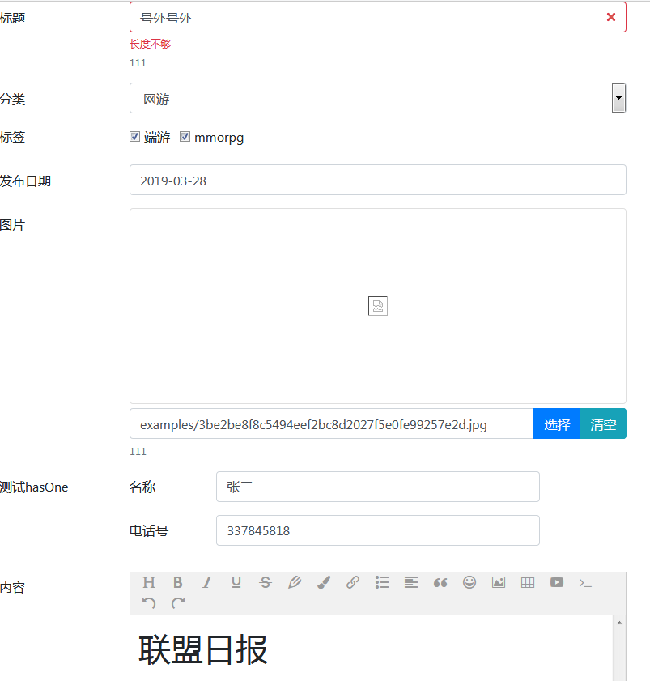

## 基础表单组件库


### 说明

>基于 bootstrap4 封装的 Form 组件


> 向 Yii2 和 laravel-admin 借鉴很多 


```php
$container = new \League\Container\Container();

//注册 控件
foreach (\Kyanag\Form\fieldMappings() as $name => $class){
    $container->add($name, $class);
}


$formBuilder = new \Kyanag\Form\Builders\FormBuilder(new \Kyanag\Form\Widgets\Form(), $container);
$formBuilder->method("get");

$formBuilder->hidden("id");
$formBuilder->text("title", "标题")->help("111")->error("长度不够");
$formBuilder->select("category_id", "分类")->options([
    ['value' => 1, "name" => "单机"],
    ['value' => 2, "name" => "网游"]
]);

$formBuilder->checkbox("tags", "标签")->options([
    ['value' => 1, "name" => "端游"],
    ['value' => 2, "name" => "mmorpg"]
]);

$formBuilder->datetime("created_at", "发布日期");

$formBuilder->ajax_image("bg_img", "图片")->help("111");

$formBuilder->hasOne("member", "测试hasOne", function(\Kyanag\Form\Builders\NestedFormBuilder $form){
    $form->text("name", "名称")->required();
    $form->text("mobile", "电话号")->required();
});

$formBuilder->editor("context", "内容");

$formBuilder->value([
    'id' => 1,
    'title' => "号外号外",
    'category_id' => 2,
    'desc' => "燃烧军团入侵了!!",
    'tags' => [1, 2],
    'created_at' => "2019-03-28",
    'bg_img' => "asserts/p.png",
    'context' => "<h1>联盟日报</h1>",
    'member' => [
        'name' => "张三",
        "mobile" => "337845818"
    ],
    'status' => 1,
]);
$form = $formBuilder->toField();

$formBuilder->render()
```

